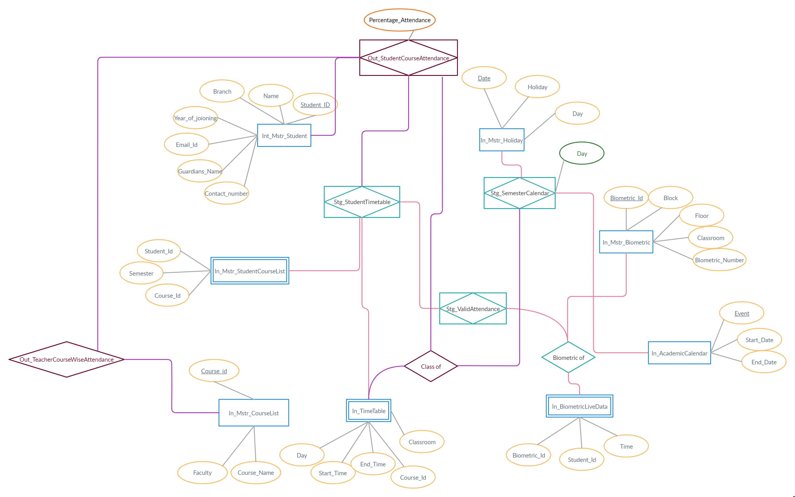

# Attendance-management
An attendance management system using T-sql/Ms Sql Server

# Overview
In this project, we aim to build a Biometric-based Attendance Management System. The attendance of the students is recorded by obtaining their biometrics when they enter and leave the allotted classrooms for their respective courses. Four biometric-sensors shall be installed in each classroom and the students may record their attendance using any of the four sensors. The live data obtained from the sensors is used to keep track of the attendance of every student in each of the courses they have enrolled for as well as subject-wise attendance of every course that the institute offers. The database is designed with the help of SQL Server Management Studio (SSMS).

# Data Dictionaries:
## Input Tables: 7+1 live data table
- **[In_AcademicCalender]**:-This table contains  information about the semester, mid-sems and end-sems.
- **[In_Mstr_Biometric]**:-This table contains information about the biometric-sensors that are present in the classrooms.
- **[In_Mstr_CourseList]**:-It has information about the courses and the faculty teaching them.
- **[In_Mstr_Holidays]**:-This is a holiday calendar table which is required so that we can calculate the accurate number of scheduled classes in the given semester
- **[In_Mstr_Student]**:-This table contains the complete details of the student like their name ,id, email,phone no.etc.
- **[In_Mstr_StudentCoursesList]**:-This contains the information about courses taken by each student for that particular semester.
- **[In_Timetable]**:- This is the timetable providing the information regarding the course day, time and classroom.
- **[In_BiometricLiveData]**:- This table records live information about the punching of attendance by the student at the beginning and the end of the class along with the biometric machine id and the punching time. This table will be processed at the end of the day to generate the required output reports.

## Staging Tables:
- **[Stg_StudentTimeTable]**:-This table makes a timetable for  students  according to the courses taken by them using In_Mstr_StudentCoursesList and In_Timetable.
- **[Stg_StudentTimeTable]**:-This table makes a timetable for  students  according to the courses taken by them using In_Mstr_StudentCoursesList and In_Timetable.
- **[Stg_ValidAttendance]** :-This table checks whether a student has marked a valid attendance or not by comparing it with the courses they have taken and their corresponding time and classroom.

## Output Tables:
- **[Out_StudentCourseAttendance]**:- This is the output table to display the attendance along with percentage and the details of the student in each course. A small code is also commented if someone wants to view the attendance of the single person. For that a variable is declared which can take the ID from the login software and then match it with the entries present in the table to display the result.
- **[Out_TeacherCoursewiseAttendance]**:-Similarly teachers can check which students have less attendance in their courses. The name can be from the login software. They can filter the result by their course Ids.They can also set Parameters like Threshold attendance. This table also gives the details of the students like email and contact number so that the instructor can reach out to them regarding their falling attendance.

# ER Diagram

